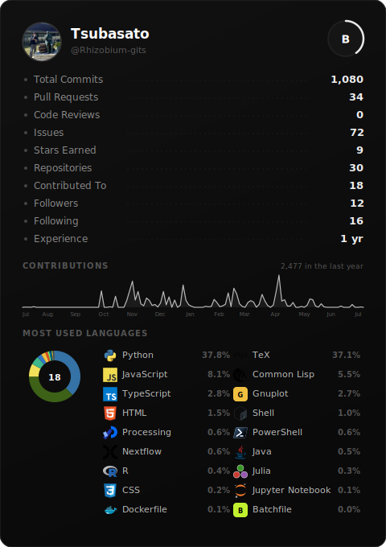
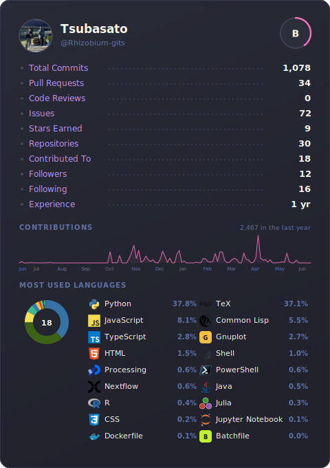
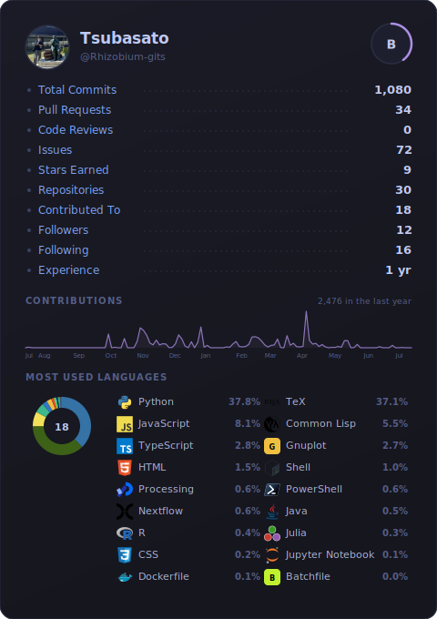
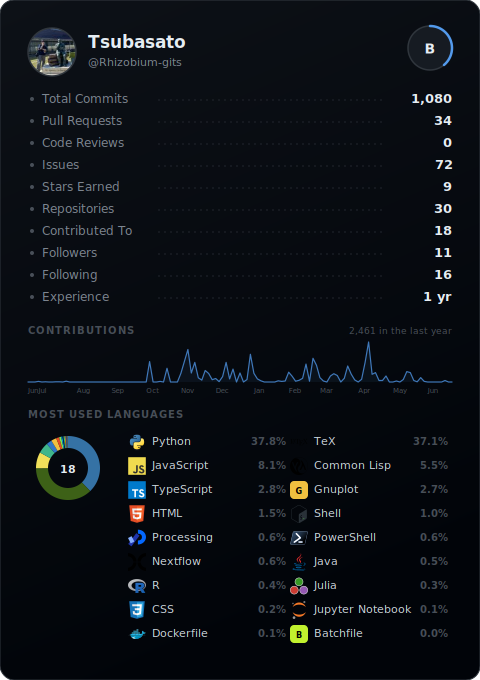
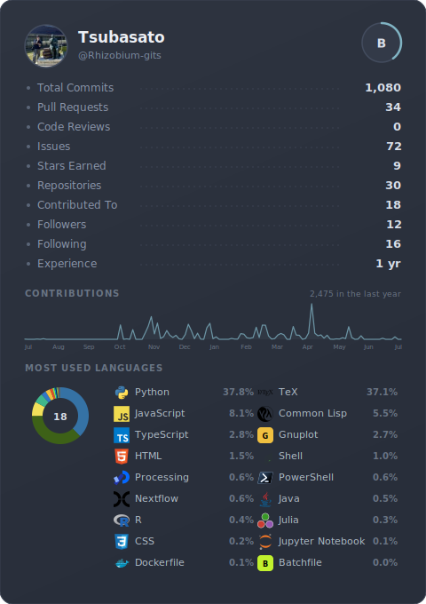
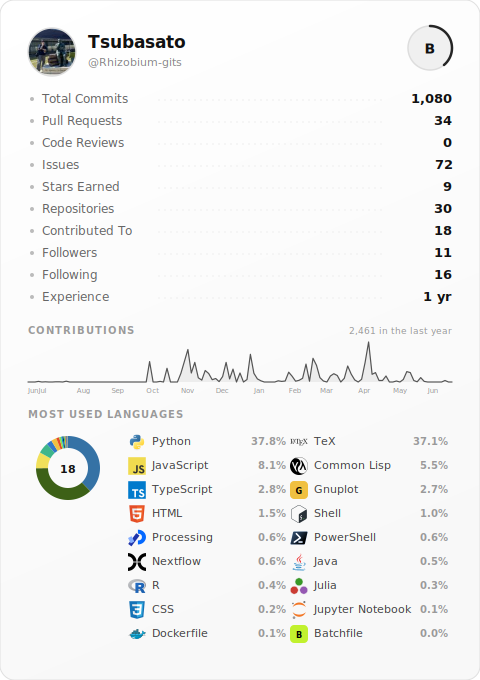

# GitHub Trophies



[English](#english) | [日本語](#japanese) | [中文](#chinese) | [Preview & Copy](https://rhizobium-gits.github.io/github-trophies/)

---

## English

GitHub stats card for your README. Fork, set username, pick a theme. All 32 themes are generated automatically.

**[Preview all themes and copy code here](https://rhizobium-gits.github.io/github-trophies/)**

### Theme Examples

| noir | dracula | tokyo-night |
|------|---------|-------------|
|  |  |  |

| github-dark | nord | light |
|-------------|------|-------|
|  |  |  |

### Setup

1. **Fork** this repository
2. Edit `config.json` — set your username only:
   ```json
   {
     "username": "your-github-username"
   }
   ```
3. Go to **Settings > Secrets and variables > Actions** > **New repository secret**
   - Name: `GH_TOKEN`
   - Value: [Personal Access Token](https://github.com/settings/tokens) with `read:user` scope
4. Go to **Actions** tab > **Generate Stats Card** > **Run workflow**
5. All 32 theme SVGs are generated. Pick one and add to your README:
   ```markdown
   
   ```
   Replace `YOUR_USERNAME` and `noir` with your username and preferred theme.

Cards update automatically every 6 hours.

### Themes (32)

**Dark:** `noir` `dracula` `one-dark` `monokai` `tokyo-night` `nord` `github-dark` `catppuccin` `gruvbox-dark` `solarized-dark` `synthwave` `cobalt` `ayu` `material-ocean` `rose` `night-owl` `palenight` `shades-of-purple` `panda` `horizon` `vitesse` `everforest` `kanagawa` `fleet`

**Light:** `light` `github-light` `solarized-light` `gruvbox-light` `catppuccin-latte` `light-owl` `everforest-light` `vitesse-light`

### What's shown

- Avatar, name, bio, rank circle (S / A+ / A / A- / B+ / B / B- / C+ / C)
- Total Commits / Pull Requests / Code Reviews / Issues / Stars / Repositories / Contributed To / Followers / Following / Experience
- 1-year contribution line graph (3-day intervals)
- Language donut chart with percentages (byte-count based)
- Language logos from [devicons](https://github.com/devicons/devicon) and [Simple Icons](https://github.com/simple-icons/simple-icons)

---

## Japanese

GitHub の統計情報をカード形式で README に表示。フォークしてユーザー名を設定するだけ。全32テーマが自動生成されます。

**[テーマのプレビューとコードのコピーはこちら](https://rhizobium-gits.github.io/github-trophies/)**

### テーマ例

| noir | dracula | tokyo-night |
|------|---------|-------------|
|  |  |  |

| github-dark | nord | light |
|-------------|------|-------|
|  |  |  |

### セットアップ

1. このリポジトリを **Fork**
2. `config.json` を編集 — ユーザー名のみ設定:
   ```json
   {
     "username": "あなたのGitHubユーザー名"
   }
   ```
3. **Settings > Secrets and variables > Actions** で **New repository secret**
   - Name: `GH_TOKEN`
   - Value: [Personal Access Token](https://github.com/settings/tokens)（`read:user` スコープ）
4. **Actions** タブ > **Generate Stats Card** > **Run workflow**
5. 全32テーマのSVGが生成されます。好きなテーマを選んでREADMEに追加:
   ```markdown
   
   ```
   `noir` の部分を好きなテーマ名に変更してください。

6時間ごとに自動更新されます。

### テーマ (32種)

**ダーク:** `noir` `dracula` `one-dark` `monokai` `tokyo-night` `nord` `github-dark` `catppuccin` `gruvbox-dark` `solarized-dark` `synthwave` `cobalt` `ayu` `material-ocean` `rose` `night-owl` `palenight` `shades-of-purple` `panda` `horizon` `vitesse` `everforest` `kanagawa` `fleet`

**ライト:** `light` `github-light` `solarized-light` `gruvbox-light` `catppuccin-latte` `light-owl` `everforest-light` `vitesse-light`

### 表示内容

- アバター、名前、bio、ランクサークル (S ~ C)
- Commits / PRs / Code Reviews / Issues / Stars / Repos / Contributed To / Followers / Following / Experience
- 1年間の Contribution 線グラフ（3日間隔）
- 言語ドーナツチャート（バイト数ベース）
- [devicons](https://github.com/devicons/devicon) と [Simple Icons](https://github.com/simple-icons/simple-icons) の言語ロゴ

---

## Chinese

GitHub 统计卡片，显示在你的 README 中。Fork 后设置用户名即可。全部 32 个主题自动生成。

**[预览主题和复制代码](https://rhizobium-gits.github.io/github-trophies/)**

### 主题示例

| noir | dracula | tokyo-night |
|------|---------|-------------|
|  |  |  |

| github-dark | nord | light |
|-------------|------|-------|
|  |  |  |

### 设置步骤

1. **Fork** 本仓库
2. 编辑 `config.json` — 只需设置用户名：
   ```json
   {
     "username": "你的GitHub用户名"
   }
   ```
3. 进入 **Settings > Secrets and variables > Actions** > **New repository secret**
   - Name: `GH_TOKEN`
   - Value: [Personal Access Token](https://github.com/settings/tokens)（`read:user` 权限）
4. 进入 **Actions** > **Generate Stats Card** > **Run workflow**
5. 全部 32 个主题的 SVG 会自动生成。选择一个主题添加到 README：
   ```markdown
   
   ```
   将 `noir` 替换为你喜欢的主题名。

每6小时自动更新。

### 主题 (32种)

**深色:** `noir` `dracula` `one-dark` `monokai` `tokyo-night` `nord` `github-dark` `catppuccin` `gruvbox-dark` `solarized-dark` `synthwave` `cobalt` `ayu` `material-ocean` `rose` `night-owl` `palenight` `shades-of-purple` `panda` `horizon` `vitesse` `everforest` `kanagawa` `fleet`

**浅色:** `light` `github-light` `solarized-light` `gruvbox-light` `catppuccin-latte` `light-owl` `everforest-light` `vitesse-light`

### 展示内容

- 头像、用户名、简介、等级圆圈 (S ~ C)
- 提交数 / PR 数 / 代码审查数 / Issue 数 / Star 数 / 仓库数 / 贡献仓库数 / 粉丝数 / 关注数 / 经验年数
- 一年贡献折线图（3天间隔）
- 语言甜甜圈图（按代码字节数计算）
- 来自 [devicons](https://github.com/devicons/devicon) 和 [Simple Icons](https://github.com/simple-icons/simple-icons) 的语言图标

---

## Tech Stack

| Category | Technology |
|----------|-----------|
| Card Generation | Node.js, SVG |
| CI/CD | GitHub Actions |
| Preview Site | GitHub Pages (static HTML) |
| Data Source | GitHub REST API, GitHub GraphQL API |
| Language Icons | [devicons](https://github.com/devicons/devicon), [Simple Icons](https://github.com/simple-icons/simple-icons) |
| Rank Algorithm | CDF Percentile ([github-readme-stats](https://github.com/anuraghazra/github-readme-stats)) |

## License

MIT
