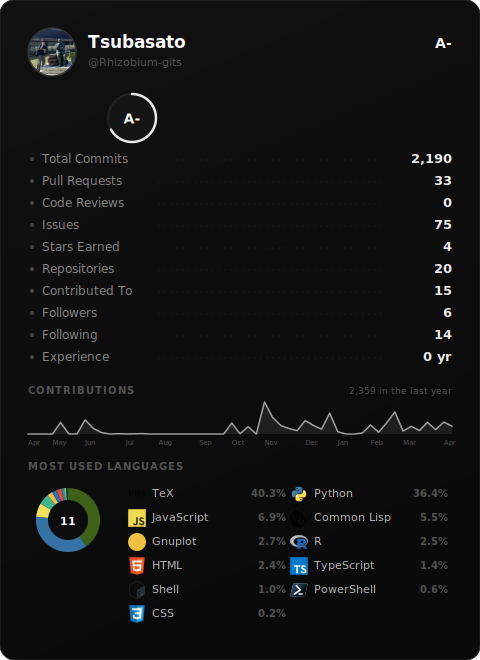

# GitHub Trophies



[English](#english) | [日本語](#japanese) | [中文](#chinese) | [Preview & Config Generator](https://rhizobium-gits.github.io/github-trophies/)

---

## English

A GitHub stats card generator for your README. [Preview & Config Generator](https://rhizobium-gits.github.io/github-trophies/) Runs entirely on GitHub Actions — no external services needed.

### Setup

1. **Fork** this repository
2. Edit `config.json` — set your GitHub username and theme:
   ```json
   {
     "username": "your-github-username",
     "theme": "noir"
   }
   ```
3. Go to **Settings > Secrets and variables > Actions**, click **New repository secret**
   - Name: `GH_TOKEN`
   - Value: a [Personal Access Token](https://github.com/settings/tokens) with `read:user` scope
4. Go to **Actions** tab > **Generate Stats Card** > **Run workflow**
5. Add this to your README:
   ```markdown
   
   ```

The card updates automatically every 6 hours.

### Themes (32)

**Dark:** `noir` `dracula` `one-dark` `monokai` `tokyo-night` `nord` `github-dark` `catppuccin` `gruvbox-dark` `solarized-dark` `synthwave` `cobalt` `ayu` `material-ocean` `rose` `night-owl` `palenight` `shades-of-purple` `panda` `horizon` `vitesse` `everforest` `kanagawa` `fleet`

**Light:** `light` `github-light` `solarized-light` `gruvbox-light` `catppuccin-latte` `light-owl` `everforest-light` `vitesse-light`

### What's shown

- Avatar, name, bio, rank (S / A+ / A / A- / B+ / B / B- / C+ / C)
- Total Commits / Pull Requests / Issues / Stars / Repositories / Experience
- 1-year contribution graph
- Language donut chart with percentages (byte-count based)
- Language logos from [devicons](https://github.com/devicons/devicon) and [Simple Icons](https://github.com/simple-icons/simple-icons)

---

## Japanese

GitHub の統計情報をカード形式で README に表示するツール。[プレビュー & 設定生成](https://rhizobium-gits.github.io/github-trophies/)GitHub Actions だけで動作し、外部サービスは不要です。

### セットアップ

1. このリポジトリを **Fork**
2. `config.json` を編集 — ユーザー名とテーマを設定:
   ```json
   {
     "username": "あなたのGitHubユーザー名",
     "theme": "noir"
   }
   ```
3. **Settings > Secrets and variables > Actions** で **New repository secret** をクリック
   - Name: `GH_TOKEN`
   - Value: [Personal Access Token](https://github.com/settings/tokens)（`read:user` スコープ）
4. **Actions** タブ > **Generate Stats Card** > **Run workflow** で実行
5. README に以下を追加:
   ```markdown
   
   ```

カードは6時間ごとに自動更新されます。

### テーマ (32種)

**ダーク:** `noir` `dracula` `one-dark` `monokai` `tokyo-night` `nord` `github-dark` `catppuccin` `gruvbox-dark` `solarized-dark` `synthwave` `cobalt` `ayu` `material-ocean` `rose` `night-owl` `palenight` `shades-of-purple` `panda` `horizon` `vitesse` `everforest` `kanagawa` `fleet`

**ライト:** `light` `github-light` `solarized-light` `gruvbox-light` `catppuccin-latte` `light-owl` `everforest-light` `vitesse-light`

### 表示内容

- アバター、名前、bio、ランク (S ~ C)
- Commits / PRs / Issues / Stars / Repos / Experience
- 1年間の Contribution グラフ
- 言語ドーナツチャート（バイト数ベース）
- [devicons](https://github.com/devicons/devicon) と [Simple Icons](https://github.com/simple-icons/simple-icons) の言語ロゴ

---

## Chinese

GitHub 统计卡片生成工具。[预览 & 配置生成器](https://rhizobium-gits.github.io/github-trophies/)完全基于 GitHub Actions 运行，无需外部服务。

### 设置步骤

1. **Fork** 本仓库
2. 编辑 `config.json` — 设置你的 GitHub 用户名和主题：
   ```json
   {
     "username": "你的GitHub用户名",
     "theme": "noir"
   }
   ```
3. 进入 **Settings > Secrets and variables > Actions**，点击 **New repository secret**
   - Name: `GH_TOKEN`
   - Value: [Personal Access Token](https://github.com/settings/tokens)（需要 `read:user` 权限）
4. 进入 **Actions** 标签 > **Generate Stats Card** > **Run workflow** 手动运行
5. 在 README 中添加：
   ```markdown
   
   ```

卡片每6小时自动更新。

### 主题 (32种)

**深色:** `noir` `dracula` `one-dark` `monokai` `tokyo-night` `nord` `github-dark` `catppuccin` `gruvbox-dark` `solarized-dark` `synthwave` `cobalt` `ayu` `material-ocean` `rose` `night-owl` `palenight` `shades-of-purple` `panda` `horizon` `vitesse` `everforest` `kanagawa` `fleet`

**浅色:** `light` `github-light` `solarized-light` `gruvbox-light` `catppuccin-latte` `light-owl` `everforest-light` `vitesse-light`

### 展示内容

- 头像、用户名、简介、等级 (S ~ C)
- 提交数 / PR 数 / Issue 数 / Star 数 / 仓库数 / 经验年数
- 一年贡献图表
- 语言甜甜圈图（按代码字节数计算）
- 来自 [devicons](https://github.com/devicons/devicon) 和 [Simple Icons](https://github.com/simple-icons/simple-icons) 的语言图标

---

## License

MIT
